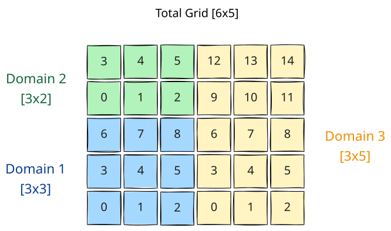
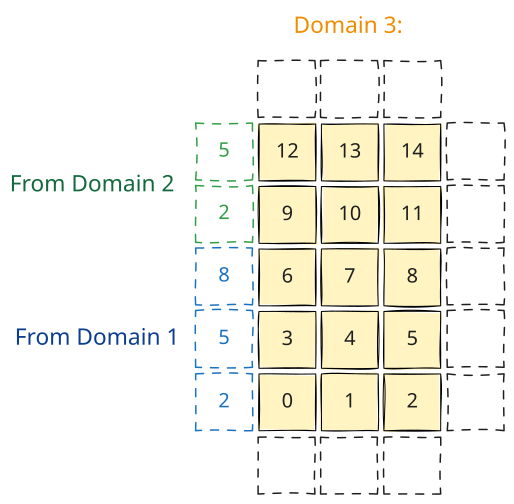
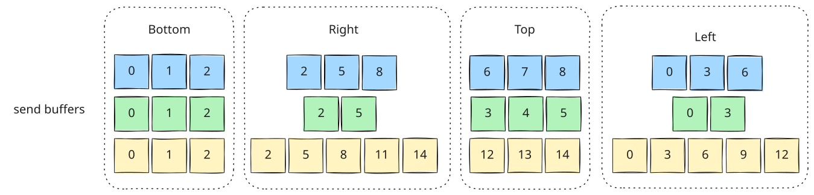
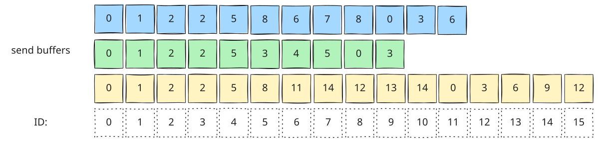
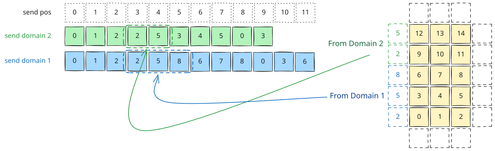
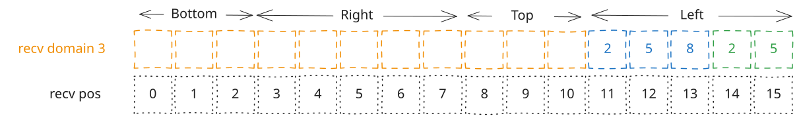

.. _halo-exchange:

Halo Exchange Logic
===================

Introduction
------------

neXtSIM_DG uses MPI to parallelize computation across multiple processes. The total grid is divided
into smaller subdomains, each assigned to a different processor. Each processor maintains its own
local domain and communicates with neighboring processors through a halo region. Below is an example
domain decomposition of the total grid into three domains.

Halo Exchange Overview
----------------------

In the following example, we will focus on ``domain 3``. The figure below shows the edge halo
regions surrounding ``domain 3``. The ``bottom``, ``right`` and ``top`` edges are all on the border.
In this example, we do not use periodic boundaries. So these edges will remain empty. However, the
left edge has two neighbours. The ``left`` edge has 5 elements, 3 coming from ``domain 1`` and 2
coming from ``domain 2``.

The ``domain_decomp`` tool is designed to generate all the metadata we need to understand which data
to get, which process to get it from and where to store it. To do so, for each neighbour it
generates the following metadata (in file ``partition_metadata_X.nc``, where ``X`` is the total
number of processes/domains):

* ``left_neighbours(P)``
* ``left_neighbour_ids(L)``
* ``left_neighbour_halos(L)``
* ``left_neighbour_halo_send(L)``
* ``left_neighbour_halo_recv(L)``

``P`` is the total number of processes/domains and ``L`` is the total number of ``left`` neighbours
across all domains. In our example the only rank that can have left neighbours is ``domain 3``.
Therefore, ``left_neighbours`` would be set as ``left_neighbours = 0, 0, 2``, meaning no left
neighbours for rank ``0``, no left neighbours for rank ``1`` and 2 left neighbours for rank ``2``.
``left_neighbour_ids(L)`` and ``left_neighbour_halos(L)`` are used to describe which processes to
get data from, and how much data to fetch, respectively. In this case, they would look like this:

.. code-block::

   left_neighbour_ids = 0, 1
   left_neighbour_halos = 3, 2

This means fetch 3 elements from rank ``0``, and 2 elements from rank ``1``. To explain how
``left_neighbour_halo_send`` and ``left_neighbour_halo_recv`` work, we first need to understand the
``send`` and ``recv`` buffers that are used in ``Halo.hpp``. Each rank produces as ``send`` and
``recv`` buffer which it will use to temporarily store the halo data during halo exchange. Each
domain creates it ``send`` buffer by forming a 1D buffer from it edges in the order ``bottom``,
``right``, ``top`` and ``left``. This is demonstrated for all domains in the diagram below.

In the previous diagram the edges were grouped to demonstrate how they are produced. But in reality
they are stored as a single 1D array as shown in the following figure.

Lets focus on the halo data from ``domain 1``. We know that we need elements ``2``, ``5`` and ``8``.
In ``Halo.hpp``, the ``send`` and ``recv`` buffers are made accessible through ``MPI_Win`` RMA
memory windows. So, we need to know where in rank ``0``'s ``send`` buffer to look for elements
``2``, ``5`` and ``8``. ``domain_decomp`` gives us ``left_neighbour_halo_send`` which is the
position offset in the send buffer (shown as ``send pos`` in the diagram below). So for our example,
``left_neighbour_halo_send`` would be ``left_neighbour_halo_send = 3, 3``. This means that we need
to read 3 elements (``left_neighbour_halos[0] = 3``) from position ``left_neighbour_halo_send[0] =
3`` in the ``send`` buffer of rank 0. Similarly, (by coincidence given this particular
decomposition) the ``left_neighbour_halo_send`` send position for domain 2 is also ``3``.

Lastly, we just need to know where to store this data, when we receive it. This is where
``left_neighbour_halo_recv`` comes in handy. ``left_neighbour_halo_recv`` is the position offset in
the ``recv`` buffer. Like the ``send`` buffer, the ``recv`` buffer has the same layout, stored in
the order ``bottom``, ``right``, ``top`` and ``left``. For this example, ``left_neighbour_halo_recv
= 11, 14``. This tells us to store the 3 elements of domain 1 starting at offset ``11`` and the 2
elements from domain 2 at offset ``14``.

The final step of ``Halo.hpp`` is to then copy the data from the ``recv`` buffer back to the
``ModelArray``, ``DGVector`` or ``CGVector`` (depending on the underlying data type).

Notes
-----

``Halo.hpp`` is still under active development. This documentation applies in a similar way for
corner neighbours (currently being implemented). Also, this diagram represents face-centered values
like those in ``ModelArray`` ``HField``'s for example. A similar approach is used for
``VertexField``'s and ``CGVector``'s (currently being implemented).
